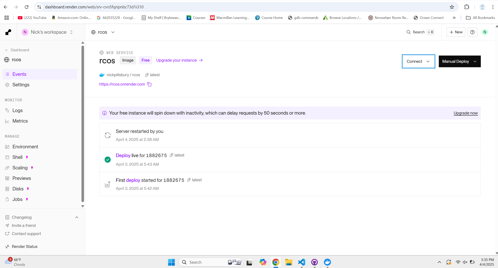
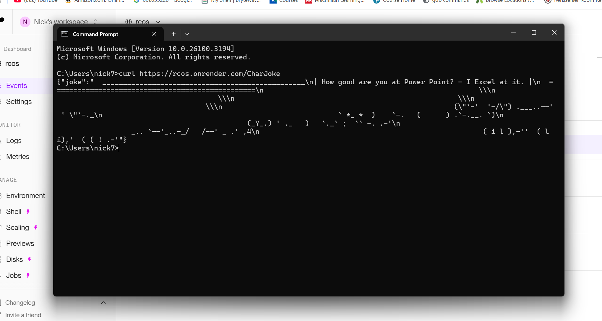

# Deploying a Docker Image on Render (Free Hosting)

This guide walks you through deploying a Dockerized web application on [Render.com](https://render.com) for free.

---

## What is Render?

[Render](https://render.com) is a cloud platform that makes it super easy to host web services, static sites, cron jobs, background workers, and even Docker containers — with a **free tier**!

---

## Requirements

Before you begin:
- A **Render account** (create one at [render.com](https://render.com)) — *Free!*
- A **Docker image** pushed to Docker Hub
- (Optional) You can also use GitHub, but in this guide we’re using Docker Hub

---

## Step 1: Deploy Your Docker Image

1. Copy your Docker Hub image link (e.g., `docker.io/username/myapp:latest`)
2. On the Render dashboard, click **"New" → "Web Service"**
3. Choose **"Deploy an existing image from a registry"**
4. Paste your Docker Hub image link
5. Choose the **Free Plan**
6. Fill in any required **environment variables**
7. Click **Deploy!**

---

## Step 2: Using Your Service

- Once deployed, Render will provide a **public URL** for your web service
- Use that link to make requests to your running container
- You can view logs and redeploy any time from the dashboard

---

## Example

