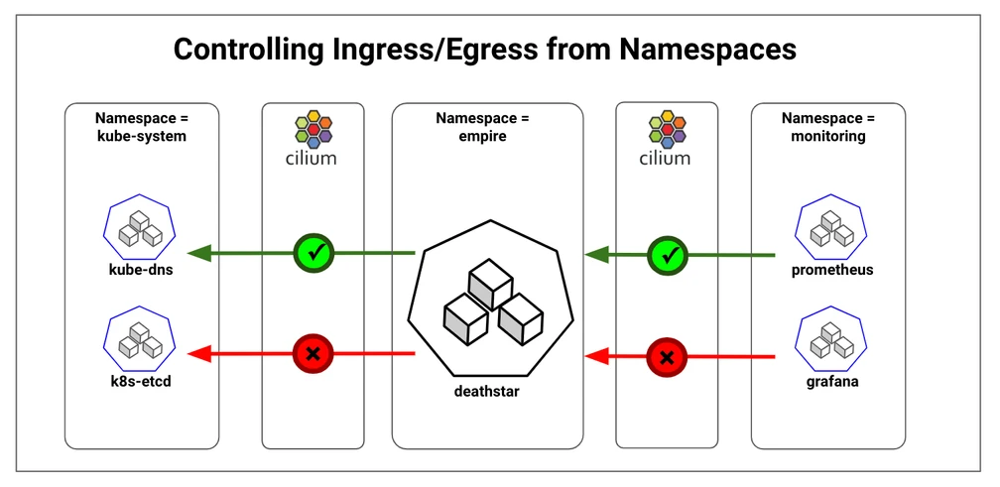

# What is Namespace Isolation?
**Namespace isolation** in Kubernetes is a mechanism that allows you to create isolated environments within the same cluster. These environments are referred to as namespaces. By default, Kubernetes clusters have no isolation between namespaces, meaning that all services within the cluster can communicate with each other unless network policies are implemented to restrict them.

With Cilium, you can enhance namespace isolation by leveraging network policies to control traffic flow between pods and namespaces. This is particularly useful in scenarios where you need to ensure that different environments, teams, or microservices do not interfere with each other.

---

## Benefits of Namespace Isolation with Cilium:
- **Security:** Namespace isolation restricts communication between services in different namespaces, helping you enforce the principle of least privilege.
- **Resource Management:** Isolating workloads in separate namespaces allows for better management of resources such as CPU, memory, and storage.
- **Operational Control:** Isolating namespaces can prevent accidental access or modification of services, which is important in multi-tenant environments.
- **Segmentation of Traffic:** You can isolate traffic between different parts of your application, making it easier to control network flow and troubleshoot issues.

---

---

## Links
[Network Policies Using Cilium](https://cilium.io/blog/2018/09/19/kubernetes-network-policies/)