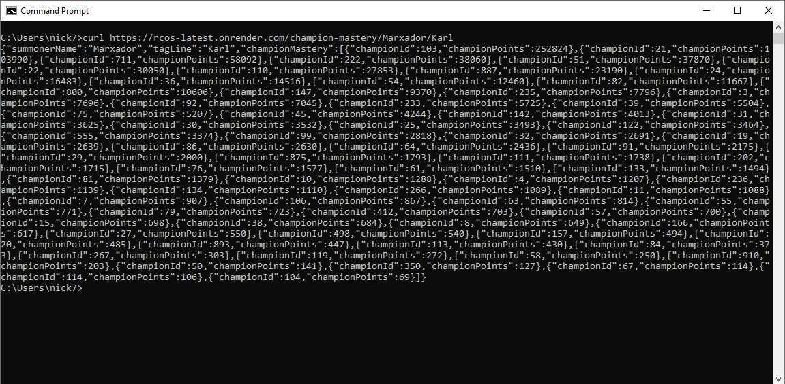
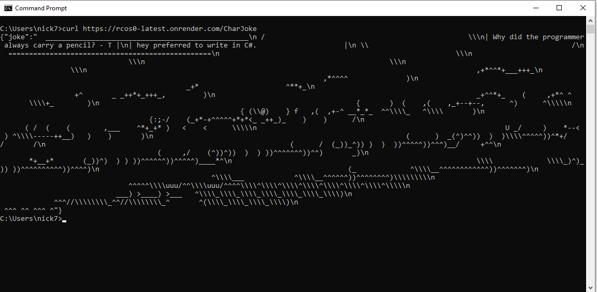

# Riot FastAPI App Deployment with Cilium

This project provides an API for querying Riot Games player data including recent match history, champion mastery, and player ranks, using FastAPI.

---

## Features
- View recent match history with detailed stats.
- Fetch champion mastery info.
- Check player rank information.
- Clean FastAPI implementation.
- Uses `.env` file for secure Riot API key management.

---

## Project Files
- `main.py` - FastAPI app exposing Riot API endpoints.
- `riot.py` - Functions handling Riot API requests.
- `.env` - Contains the Riot API key (`RIOT_API_KEY`).
- `Dockerfile` - Docker configuration for the app.
- `requirements.txt` - File of required python packages.

---

## Prerequisites

- Docker installed
- Kubernetes cluster with **Cilium** as CNI
- `kubectl` and `helm` installed and configured
- Riot API key in a `.env` file

---

## Deploying with Docker & Cilium


### 1. Dockerize the App

Make sure your `.env` file is in the same directory as your `Dockerfile`.

```bash
docker build -t riot-api-app .
```
You can test it locally before deploying:

bash
```bash
docker run --env-file .env -p 8000:8000 riot-api-app
```

### 2. Push to Container Registry
Tag and push your image to Docker Hub (or another registry):

```bash
docker tag riot-api-app yourusername/riot-api-app:latest
docker push yourusername/riot-api-app:latest
```

### 3. Create Kubernetes Secrets for .env
```bash
kubectl create secret generic riot-env-secret --from-env-file=.env
```


### 4. Deploy in Kubernetes/Cilium Cluster
Use a Kubernetes deployment YAML file:

```yaml
# riot_fastapi.yaml
apiVersion: apps/v1
kind: Deployment
metadata:
  name: riot-api
spec:
  replicas: 1
  selector:
    matchLabels:
      app: riot-api
  template:
    metadata:
      labels:
        app: riot-api
    spec:
      containers:
      - name: riot-api
        image: yourusername/riot-api-app:latest
        ports:
        - containerPort: 8000
        envFrom:
        - secretRef:
            name: riot-env-secret
---
apiVersion: v1
kind: Service
metadata:
  name: riot-api-service
spec:
  selector:
    app: riot-api
  ports:
    - protocol: TCP
      port: 80
      targetPort: 8000
  type: LoadBalancer
```

Apply your yaml file to deploy your app in the cluster
```bash
kubectl apply -f riot-api-deployment.yaml
```

---

## Using this App
Access your service via external IP or ingress:

- / - Root with info
- /recent-match-history/{name}/{tag}/{count}
- /champion-mastery/{name}/{tag}
- /rank_info/{name}/{tag}

Example:
```bash
curl http://<your-external-ip>/recent-match-history/Faker/NA1/10
```

