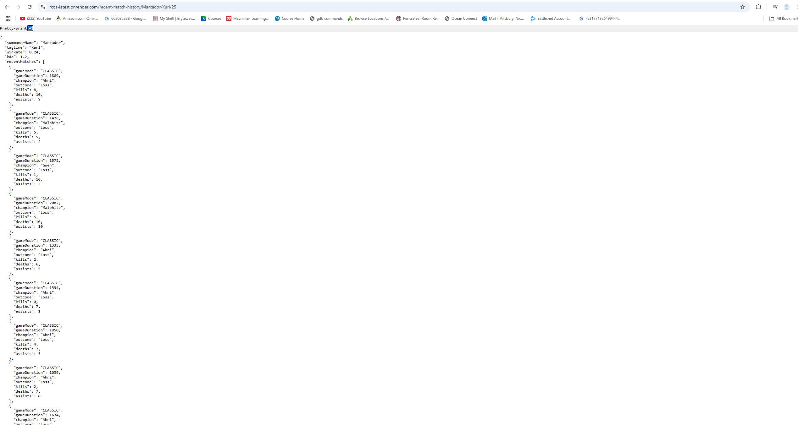
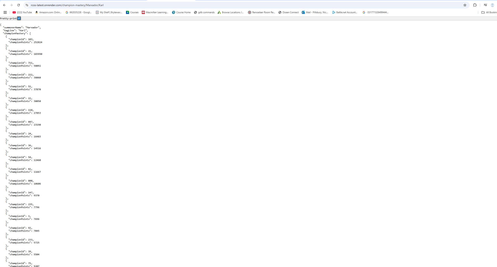
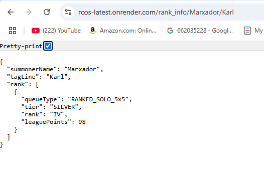
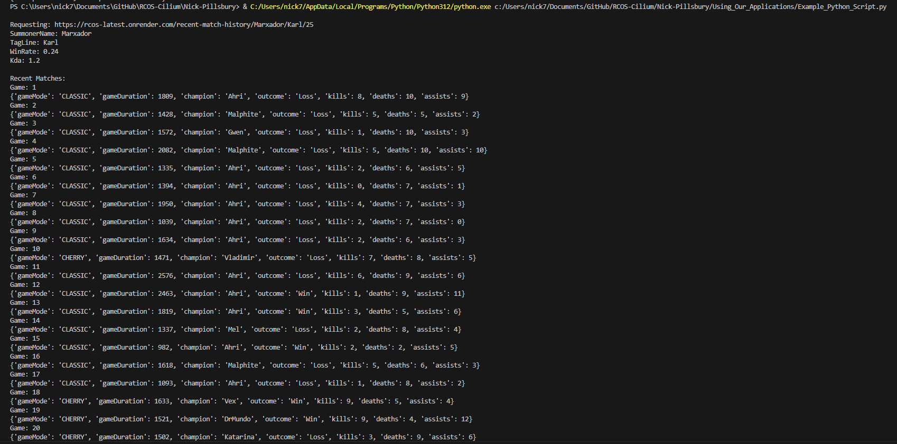

# Using Containerized Applications
This guide explains how to run containerized applications both locally and globally, and how to interact with them using various methods.

---

## Deploying An Application Locally
There are several ways to deploy an application locally depending on your environment and tooling. Here are some common ones:

### 1. Run With Docker
You can use Docker Desktop or the Docker CLI to build and run your application locally in a container.
```bash
docker build -t your-app-name .
docker run -p 8000:8000 your-app-name
This will make your app accessible at http://localhost:8000.
```

### 2. Run In A Cluster
You can also deploy them in a cilium or kubernetes cluster.
Create a yaml file.
```yaml
# deployment.yaml
apiVersion: apps/v1
kind: Deployment
metadata:
  name: your-app
spec:
  replicas: 2
  selector:
    matchLabels:
      app: your-app
  template:
    metadata:
      labels:
        app: your-app
    spec:
      containers:
      - name: your-app
        image: your-dockerhub-username/your-app-name
        ports:
        - containerPort: 8000
```
Apply the deployment and expose it:
```bash
kubectl apply -f deployment.yaml
kubectl expose deployment your-app --type=LoadBalancer --port=80 --target-port=8000
You can now access your app using the external IP provided by the cluster.
```

---

## Hosting Globally
To make your application publicly available, you can either:
- Open your home network to external traffic (not recommended for production)
- Use a cloud platform to host your app securely and reliably

### Common Cloud Hosting Platforms

- **Render**  
  Easy-to-use for web apps and APIs.  
  [https://render.com](https://render.com)

- **Heroku**  
  One-click deployments with GitHub integration. 
  [https://heroku.com](https://heroku.com)

- **Railway**  
  Fast and developer-focused hosting with instant previews.
  [https://railway.app](https://railway.app)

- **AWS (Amazon Web Services)**  
  Highly customizable cloud infrastructure. 
  [https://aws.amazon.com](https://aws.amazon.com)

- **Google Cloud (GCP)**  
  Great for containerized workloads and scaling.
  [https://cloud.google.com](https://cloud.google.com)

- **Microsoft Azure**  
  Enterprise-ready cloud with a wide range of services. 
  [https://azure.microsoft.com](https://azure.microsoft.com)

---

## Hosting Locally Vs Hosting Globally

| Feature       | Local Hosting                          | Global Hosting                         |
|---------------|-----------------------------------------|-----------------------------------------|
| Accessibility | Only on your machine or local network  | Accessible from anywhere                |
| Use Case      | Development, testing                   | Production, public use                  |
| Reliability   | Depends on your machine                | Backed by infrastructure and SLAs       |
| Security      | Limited control                        | Usually includes HTTPS and firewalls    |

---

## Making Requests To A Cloud Or Cluster-Deployed Application

Once your application is deployed to the cloud or within a cluster (like Kubernetes), making requests is essentially the same as calling any public web service — but there are a few key things to know.

### 1. Get The Public URL

After deployment, your platform will usually give you a public URL (e.g., `https://your-app.onrender.com` or an IP address + port if exposed manually in a cluster).

- **Cloud Services (Render, Railway, Heroku, etc.)**  
  These typically provide a secure HTTPS URL automatically.

- **Kubernetes Clusters**  
  You may expose your service using:
  - A **LoadBalancer** service (get external IP with `kubectl get svc`)
  - An **Ingress controller** with a domain name
  - Port-forwarding (for local testing):  
    ```bash
    kubectl port-forward svc/your-service 8000:80
    ```

### 2. Making Requests
You can send requests to your application in multiple ways:

Browser – Visit https://your-app.com/api/endpoint

Command Line – Use curl:

```bash
curl https://your-app.com/api/endpoint
```

Programming Languages – For example, using Python:

```python
import requests

url = "https://your-app.com/api/endpoint"
response = requests.get(url)
print(response.json())
```

---

## Examples





