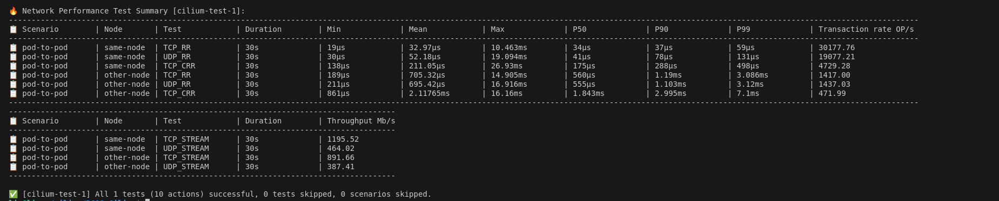

# Cilium Performance Benchmark

Performance testing is a form of quality assurance, evaluating an application/system's capabilities to meet the expected user demand. Without performance testing various defects can exist unknown threating to disrupt or even stop the application/system's operations. Thus, performance testing is integral for any application/system to succeed.

Cilium is ...

We seek to construct a test suite targeting various Cilium tuning parameters and evaulate the performance and capabilites of each parameter. To accomplish our goals, we utilize Terraform's resource-targeting mechanism allowing the freedom to enable or disable certain tuning parameters. Additionally, we aim to overcome two pitfalls observed from the current Cilium performance benchmark [1]. Firstly, pre-existing Cilium documentation of performance is outdated and no longer holds any value to the existing Cilium user base. We seek to rectify this by replicating Cilium's pre-existing performance test on the updated versions of Cilium. Secondly, Cilium's performance benchmark lacks scope as only 3 metrics are utilized in their testing. By expanding the tested metrics from 3 to 7, we can improve the usability and insight the performance banchmark provides. 

## Metrics Tested

Throughput \
    Maximum transfer rate via a single TCP connection and the total transfer rate of 32 accumulated connections [1].

Request/Response Rate \
    The number of request/response messages per second that can be transmitted over a single TCP connection and over 32 parallel TCP connections [1].

Connections Rate \
    The number of connections per second that can be established in sequence with a single request/response payload message transmitted for each new connection. A single process and 32 parallel processes are tested [1].

Latency \
    Measurement of the delay of a packets's arrival to its destination from a single TCP connection.

CPU Utilization \
    Percentage of the CPU's processing capacity used by a single TCP connection.

Memory Usage \
    The required amount of RAM to faciliate a single TCP connection.

Network Jitter \
    The variation of packet delay or latency over a single TCP connection.

## Tuning parameters
See https://docs.cilium.io/en/stable/operations/performance/tuning/ for the tuning parameters to change. \
We will only be testing the following parameters: \
Netkit Device Mode \
BIG TCP \
Hubble Obserbability \
Bypassing Iptables Tracking \
MTU \
Bandwith Manager \
BBR Congestion Control for Pods \
XDP Acceleration
<!-- eBPF Map Sizing \ -->

<!-- ## Expected Results
BIG TCP
Improved throughput and latency
Increased CPU utilization (more CPU strain) 

MTU
Increased throughput
Increased Jitter and Data corruption / Packets Dropped
Increased CPU utilization

BBR Congestion Control for Pods
Increased bandwidth 
Improved latency
Increased CPU utilization

XDP Acceleration
Better latency and decrease in network jitter

eBPF Map Sizing
Better scaliabiklity
Increased Memory cost

Hubble Obserbability
Increased network performance
Decreased CPU strain

Bandwith Manager
Improved latency and throughput
Increased CPU strain

Netkit Device Mode
Significant latency reductions
Improved throughput

Bypassing Iptables Tracking
Improvements in latency and throughput
Decrease in network jitter -->

## Steps & Processes

Cilium infrastructure is launched via Terraform and created on Azure using resource-targeting. A bash script is deployed to automate deployment and choose the specific tuning parameter. Results and metrics from testing are gathered through a Prometheus and Grafana backend to scrape and visualize the data. Testing of network and compute resources utilizes the built-in netperf package in the Cilium-cli, provided ansible play-books [1], and customized yaml files (stress-ng) to simulate real-world workloads. 

Future goals of the benchmark is to fully automate the process through github actions. The proposed github action workflow will run periodically as a cron job, running the bash script, testing via netperf/yaml, and gather the data. 
<!-- See for the proposed action -->
<!-- Though first we have to change the parameters through a script
See "SCRIPT" for the script

We will be using "Kernel" for all of our testing

Using bash, a script will run our Cilium infrastructure for varying intervals of times. This script will be ran for each tuning parameters and allows us to mimic usage of contianerized applications for short-term and long-term capabilities. Additionally, through the use of Prometheus and Grafana we can gather and visualize the network and CPU perfomance impact each tuning parameters has. We will then automate this testing process using github actions to test on a daily/weekly schedule.  -->

## Testing Environment

### Testing Hardware

|Item |Description |
|-----|------------|
|CPU|13th Gen Intel(R) Core(TM) i9-13900HX, FCBGA1964, 2.20GHz, 24 cores / 32 threads |
|Mainboard|LENOVO LNVNB161216 SDK0T76461 WIN|
|Memory| |
|Network Card| Intel(R) Wi-Fi 6E AX211 160MHz|
|Kernel| Microsoft Windows 10.0.22621.4455|

### Testing Configuration

|Configuration Name |Description |
|-------------------|------------|
|Baseline | Kubernetes, no Cilium|
|Cilium (legacy host-routing) | Cilium 1.16.0, legacy host-routing, kube-proxy replacement|
|Cilium | Cilium 1.16.0, eBPFhost-routing, eBPF-based kube-proxy replacement, eBPF-based masquerading|
|Cilium (netkit)| Cilium 1.16.0, eBPFhost-routing, kube-proxy replacement|
|Cilium (Big TCP)| Cilium 1.16.0, eBPFhost-routing, eBPF-based kube-proxy replacement, eBPF-based masquerading|
|Cilium (Hubble Off)| Cilium 1.16.0, Hubble Off|
|Cilium (Iptables Bypass)| Cilium 1.16.0, eBPF-based kube-proxy replacement, eBPF-based masquerading or no masquerading|
|Cilium (MTU)| Cilium 1.16.0, eBPFhost-routing, kube-proxy replacement|
|Cilium (Bandwidth Manager)| Cilium 1.16.0, eBPF-based kube-proxy replacement|
|Cilium (BBR congestion)| Cilium 1.16.0, eBPFhost-routing, Bandwidth manager|
|Cilium (XDP)| Cilium 1.16.0, eBPF-based kube-proxy replacement, native XDP driver|

## Results
| |Baseline |Cilium(legacy host-routing) |Cilium |Cilium(netkit) |Cilium(Big TCP) | Cilium(Hubble Off) | Cilium(Iptables Bypass) | Cilium(MTU) | Cilium(Bandwidth Manager) |Cilium(BBR congestion)|Cilium(XDP)|
|---|---|---|---|---|---|---|---|---|---|---|---|
|Throughput|0|0|0|0|0|0|0|0|0|0|0|
|Request/Response Rate|0|0|0|0|0|0|0|0|0|0|0|
|Connections Rate|0|0|0|0|0|0|0|0|0|0|0|
|Latency|0|0|0|0|0|0|0|0|0|0|0|
|CPU Utilization|0|0|0|0|0|0|0|0|0|0|0|
|Memory Usage|0|0|0|0|0|0|0|0|0|0|0|
|Network Jitter|0|0|0|0|0|0|0|0|0|0|0|

## Sources

[1] https://docs.cilium.io/en/stable/operations/performance/benchmark/